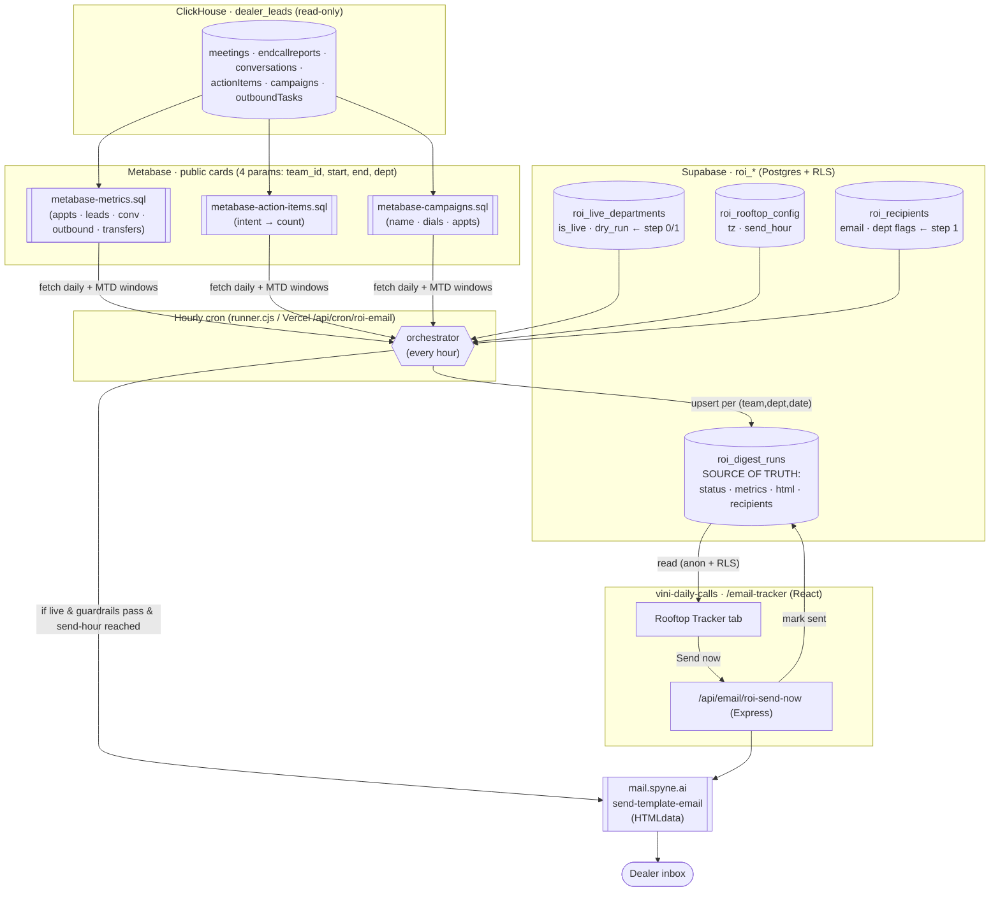
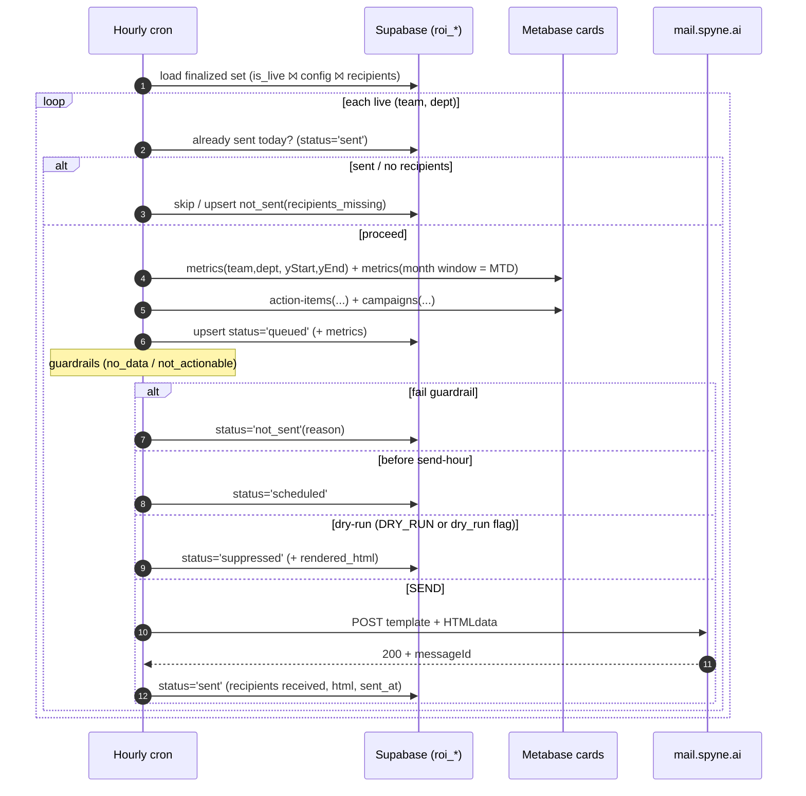

# ROI Daily Email — System Architecture

Three runtimes, one source of truth (`roi_digest_runs`). ClickHouse is reached **only**
through Metabase **public cards** (4 params each: `team_id`, `start`, `end`, `dept`) — no
DB creds, no MCP. The hourly cron orchestrates; the tracker reads/acts on the same table.

## Components



## Hourly run — sequence



## Status lifecycle (one row per team·dept·daily·local_date)
`queued` (data fetched) → `not_sent` (guardrail/recipients) | `scheduled` (pre send-hour) |
`suppressed` (dry-run) | `sent` (mailed). Idempotent: existing `sent` row blocks re-send.

## Key design choices (SDE-2 notes)
- **Metabase public cards as the data port** — decouples the cron from ClickHouse creds; the
  only ClickHouse coupling is 3 saved SQL cards. 4 params keep them generic & cacheable.
- **MTD via the same card** — call metrics with a month-start window; no second query to maintain.
- **`roi_digest_runs` is the single source of truth** — cron writes it, tracker reads it; UI and
  pipeline never disagree. Idempotency key = `(team_id, department, cadence, local_date)`.
- **Dealer-local windows** — `start`/`end` computed per rooftop timezone in the cron, passed as UTC.
- **Dry-run safe by default** — real mail only when `DRY_RUN=false` AND the rooftop isn't `dry_run`.
- **Same mail contract everywhere** — cron and tracker both POST `template + templateData.HTMLdata`.
```
