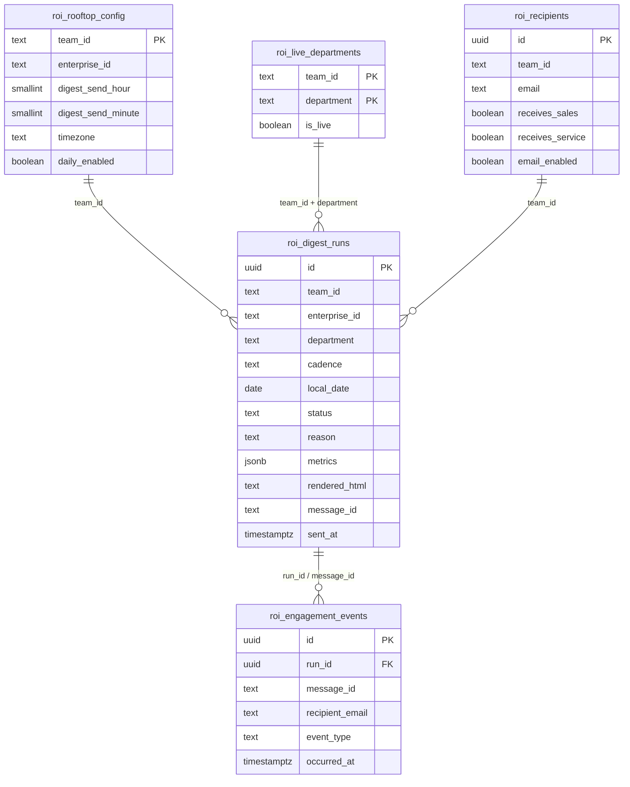
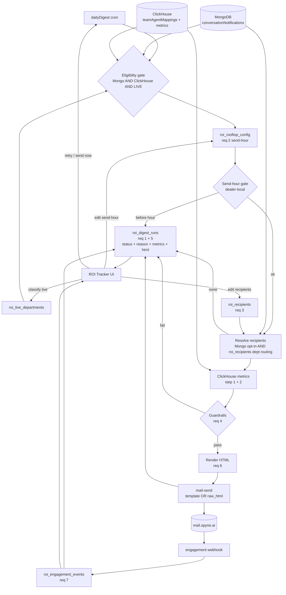
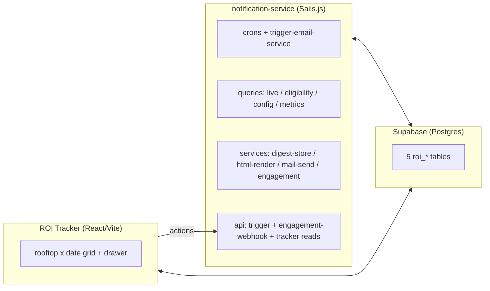

# ROI Daily Report — architecture & schema

## 1 · Schema (entity-relationship)

Logical relationships are keyed by `team_id` (globally unique, confirmed) and
`message_id` / `run_id`. Supabase tables are not hard-FK'd to ClickHouse/Mongo.

## 2 · System architecture & data flow

## 3 · Component split

