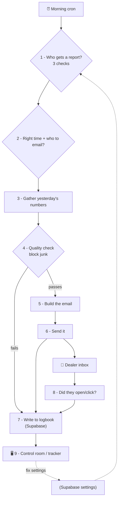

# ROI Daily Report — how it works (plain-English guide)

## The 30-second version

Every morning, a robot assistant ("Vini") writes each US car dealership a
**report card** of yesterday's phone activity (calls, leads, appointments,
service bookings), **emails it** to the right people, and logs everything to a
database. A **control room dashboard** (the "tracker") lets the customer-success
team watch which dealers got their report and fix the ones that didn't.

Three moving parts:
- **Generator + Sender** = the backend (Sails.js) — builds and emails the report.
- **Supabase** = the shared logbook + settings store (Postgres database).
- **Tracker** = the dashboard (React) the team watches.

---

## Simple architecture



---

## Flow by flow (with the file doing the work)

### Flow 1 — "Who gets a report today?"  (eligibility)
A dealer only gets a report if **three lists all agree**.

| File | Plain English |
|------|---------------|
| `cron/dailyDigest.cron.js` | The **alarm clock**. Runs every hour, finds eligible dealers, kicks off a send for each. |
| `queries/digest-eligibility.query.js` | The **bouncer**. Lets a dealer through only if: (1) MongoDB says "digest is ON", (2) ClickHouse says "they have a live, onboarded sales/service agent", and (3) Supabase says "yes, they're *actually* live." |
| `queries/live-team.query.js` | Reads list #3 — the **"actually live"** list your CSM team curates in Supabase. |
| `utils/supabase.js` | The **phone line** to Supabase (shared by everything that talks to it). |

### Flow 2 — "Is it the right time, and who should it go to?"  (timing + recipients)
| File | Plain English |
|------|---------------|
| `queries/rooftop-config.query.js` | Reads each dealer's **preferred send time** (e.g. 7 AM their time) and **who gets sales vs service** emails. |
| `utils/guards.js` | Works out the dealer's **timezone**, what "yesterday" means for them, their working hours, and looks up the **actual email addresses** of the people who opted in. |

### Flow 3 — "Gather yesterday's numbers"  (metrics)
| File | Plain English |
|------|---------------|
| `queries/sales-inbound-outbound.query.js` | Counts **sales** stuff: leads, appointments, calls answered/missed, after-hours, transfers. |
| `queries/service-inbound-outbound.query.js` | Same, for the **service** department. |
| `queries/campaign-query.js` | How the dealer's **outbound calling campaigns** performed. |
| `queries/speed-to-lead-query.js` | **How fast** we replied to new leads. |
| `utils/common.js` | Shared **calculator/formatter** (percentages, time windows, date labels). |

### Flow 4 — "Build it and quality-check it"  (assemble + guardrails)
| File | Plain English |
|------|---------------|
| `services/template-service.js` | Arranges the raw numbers into the **report's shape** (the fields the email needs). |
| `utils/guardrails.js` | The **quality inspector** (new). Blocks the email if it's junk: nothing happened, nothing actionable, impossible numbers, or month-to-date less than yesterday. |
| `services/html-render.service.js` | **Paints** the numbers into a real HTML email (new — lets us ship new designs without registering them in the mail system). |

### Flow 5 — "Send it"  (delivery)
| File | Plain English |
|------|---------------|
| `services/mail-send.service.js` | The **post office** (new). Sends the email two ways — via a stored template or our own raw HTML — and **retries** if the mail server hiccups. |
| `services/trigger-email-service.js` | The **conductor** (rewritten). Runs flows 1→5 in order for one dealer/department, then logs the result. One shared engine for both sales and service. |
| `api/controllers/v2/notification/trigger-daily-digest.js` | The **"Send now" button** (new). A web endpoint so a human (or the tracker) can trigger a send on demand. This is the curl. |

### Flow 6 — "Write down what happened"  (logbook)
| File | Plain English |
|------|---------------|
| `services/digest-store.service.js` | The **logbook** (new). For *every* dealer, every day, it records: sent or not, the reason if not, the exact numbers, and the exact email HTML — into Supabase. This is what the tracker reads. |

### Flow 7 — "Did they open it?"  (engagement)
| File | Plain English |
|------|---------------|
| `services/engagement.service.js` | When the mail provider reports **delivered / opened / clicked / bounced**, this records it and updates who actually received the email. |
| `api/controllers/v2/notification/engagement-webhook.js` | The **mailbox** the mail provider calls to deliver those open/click/bounce events. |

### Flow 8 — "The control room"  (tracker / frontend)
| File | Plain English |
|------|---------------|
| `frontend/src/tracker/supabaseClient.ts` | The tracker's **phone line** to Supabase. |
| `frontend/src/tracker/dataSource.ts` | **Translator** (new). Turns logbook rows into the grid the dashboard expects. Falls back to fake data if Supabase isn't set up. |
| `frontend/src/tracker/EmailerTracker.tsx` | The **dashboard**: a grid of dealers × days, summary cards, a funnel, filters. |
| `frontend/src/tracker/RooftopCellDrawer.tsx` | The **side panel** that opens when you click a cell — shows what was sent / why not, and fix-it buttons. |
| `frontend/src/tracker/mockData.ts` | The **fake data** used when Supabase isn't connected (so the UI always renders). |

### The database (Supabase) — the 5 tables
| Table | Plain English |
|-------|---------------|
| `roi_live_departments` | The "actually live" list (Flow 1, check #3). |
| `roi_rooftop_config` | Per-dealer send time + on/off switches (Flow 2). |
| `roi_recipients` | Who gets sales vs service emails (Flow 2). |
| `roi_digest_runs` | **The logbook** — every report, sent or not, with numbers + HTML (Flow 6). |
| `roi_engagement_events` | Opens / clicks / bounces (Flow 7). |

---

## Setup — connecting it to a real Supabase database

The code is ready; the database isn't created yet. Steps:

### 1. Create the Supabase project
- supabase.com → **New project**. Pick a region near your users.
- Go to **Settings → API** and copy three things:
  - **Project URL** (e.g. `https://abcd.supabase.co`)
  - **anon public key** (browser/tracker)
  - **service_role key** (backend only — secret)

### 2. Create the tables + config
In the Supabase **SQL Editor**, run, in order:
1. `notification-service/db/supabase-schema.sql`  → creates the 5 tables.
2. `notification-service/db/supabase-config.sql`   → RLS, grants, realtime, triggers.
3. (optional) the seed block in `db/SUPABASE-REVIEW.md` → a few test rows.

### 3. Wire the backend (generator/sender)
- Install the client in the real notification repo: `npm i @supabase/supabase-js`
- Set env / `config/custom.js`:
  ```
  SUPABASE_URL=https://abcd.supabase.co
  SUPABASE_SERVICE_KEY=<service_role key>      # secret, server-only
  ```
- (mail) `mailApi`, `mailRawApi`, `useDirectHtml`, `mailTimeoutMs`, `mailRetries` as needed.

### 4. Wire the tracker (frontend)
- Copy `frontend/.env.example` → `frontend/.env`:
  ```
  VITE_SUPABASE_URL=https://abcd.supabase.co
  VITE_SUPABASE_ANON_KEY=<anon public key>     # NOT the service key
  ```

### 5. Test end-to-end
- Trigger a send (curl):
  ```bash
  curl -X POST https://<host>/v2/notification/trigger-daily-digest \
    -H "Content-Type: application/json" \
    -d '{"enterpriseId":"7d06f7427","teamId":"49a06313cf","serviceType":"both","to":["you@spyne.ai"]}'
  ```
- In Supabase: `select * from roi_digest_runs order by created_at desc limit 5;` → see the row.
- Run the tracker: `cd frontend && npm run dev` → it now shows live data.

### 6. Before production
- **PII decision** (from SUPABASE-REVIEW.md): the tracker reading `roi_digest_runs`
  (which contains recipient emails + email HTML) from the browser needs either
  **Supabase Auth + RLS** or **reads proxied through the backend**. Don't ship the
  anon key publicly without one of these.
