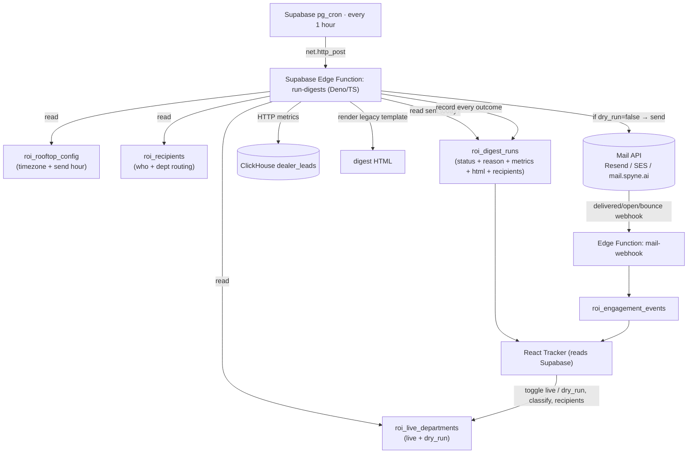

# ROI Daily Emailer — Master Plan (Supabase-only rewrite)

**Principle:** No Sails notification-service. No MongoDB. The entire system lives on
**Supabase** (database + scheduled function), reads **ClickHouse** only for metrics
(read-only, we have HTTP access), and sends via a **mail API**. The React tracker
reads Supabase directly.

> Why: we don't have Mongo access. Every input the old service got from Mongo
> (digest on/off, recipients, dedup log) now comes from **Supabase tables we own**.
> ClickHouse stays — it's the metrics source, not Mongo.

---

## 1 · Architecture

**Three runtimes only:** Supabase (Postgres + pg_cron + Edge Functions), ClickHouse
(metrics, read-only), a mail provider. That's it.

---

## 2 · The hourly flow (Edge Function `run-digests`)

Runs every hour. One pass:

1. **Pull the work-list from Supabase** (one query):
   `roi_live_departments` (is_live, dry_run) ⋈ `roi_rooftop_config` (timezone, send hour, daily_enabled) ⋈ `roi_recipients` (enabled emails per dept).
   → produces a list of `(team_id, department, timezone, send_hour, dry_run, recipients[])`.
2. For each `(team, department)` run the **eligibility gate** (§3). Each terminal
   outcome **writes one `roi_digest_runs` row** for `(team, dept, 'daily', local_date)`.
3. Eligible + not-dry-run → compute metrics (ClickHouse), render HTML, **send**, record `sent`.
   Eligible + dry-run → render HTML, record `suppressed/dry_run` (no send).
   Not eligible → record the specific `not_sent` reason (or skip silently for not-live).

No Mongo. Dedup, config, recipients, and the send log are **all Supabase**.

---

## 3 · Eligibility gate — 5 checks, each stored

Evaluated in this order (cheap → expensive). The first failure that applies is
recorded as the run's `status` + `reason` so the tracker shows exactly why.

| # | Check | Source | Pass → | Fail → stored as |
|---|-------|--------|--------|------------------|
| 1 | **Team + dept enabled** | `roi_live_departments.is_live = true` AND `roi_rooftop_config.daily_enabled = true` | continue | *(not live → no row / `not_subscribed`)* |
| 2 | **Send time passed & not already sent** | now in `roi_rooftop_config.timezone` ≥ `digest_send_hour`; AND no `roi_digest_runs` row `status='sent'` for `(team,dept,today)` | continue | before hour → `scheduled` (retry next hour); already sent → skip (idempotent) |
| 3 | **Recipients exist** | `roi_recipients` has ≥1 row for this dept (`receives_<dept>` + `email_enabled`) | continue | `not_sent` · `recipients_missing` |
| 4 | **Data guardrails valid** | compute metrics (ClickHouse) → `validateDigestPayload` | continue | `not_sent` · `no_data` / `not_actionable` / `invalid_metrics` |
| 5 | **Dry-run is OFF** | `roi_live_departments.dry_run = false` | **SEND** → `sent` | `suppressed` · `dry_run` (render + store, do not send) |

Every row stores: `status`, `reason`, `metrics` (the computed numbers), `rendered_html`
(the exact email), `recipients` (who it would/did go to), `message_id`, `sent_at`.

---

## 4 · Components — keep / rewrite / drop

| Component | Action | Where it goes |
|-----------|--------|---------------|
| Supabase schema (5 `roi_*` tables) | **KEEP** | already live |
| React tracker | **KEEP** (small tweaks) | already live |
| `html-render` (legacy template) | **PORT** JS → Deno/TS | inside the Edge Function |
| `guardrails` | **PORT** JS → Deno/TS | inside the Edge Function |
| Eligibility (3-gate Mongo/CH/Supabase) | **REWRITE** → pure Supabase queries (§3) | Edge Function |
| ClickHouse metric queries | **KEEP** (run over HTTP from Deno) | Edge Function |
| `digest-store` (record run) | **KEEP** logic → Supabase upsert in Deno | Edge Function |
| `mail-send` (template/raw HTML) | **REWRITE** → call chosen mail API directly | Edge Function |
| engagement webhook | **REWRITE** → Edge Function `mail-webhook` | Supabase |
| **Sails notification-service** | **DROP** | retired |
| **MongoDB** (`conversationNotifications`, `dailyDigestEmailLogs`, recipients) | **DROP** | replaced by `roi_*` tables |
| **`config/cron.js` (Sails cron)** | **DROP** | replaced by `pg_cron` |

---

## 5 · Data sources (no Mongo)

| Need | Old (Mongo/Sails) | New (Supabase-only) |
|------|-------------------|---------------------|
| Which teams/depts get email | Mongo `conversationNotifications` | `roi_live_departments.is_live` |
| Send hour + timezone | user-mgmt API | `roi_rooftop_config` |
| Recipients + dept routing | Mongo opt-in ∩ user-mgmt | `roi_recipients` |
| Already-sent dedup | Mongo `dailyDigestEmailLogs` | `roi_digest_runs` (status='sent') |
| Send log / tracking | Mongo + logs | `roi_digest_runs` |
| **Metrics** (appts, convos, leads…) | ClickHouse | **ClickHouse (unchanged)** |

---

## 6 · Tracker behaviours (mostly built)

- **Sent** → click → load the **exact stored `rendered_html`** + the **recipient email IDs** (with delivered/bounced from `roi_engagement_events`).
- **Not sent** → click → the **reason** + a **full-page preview** rendered from stored metrics + **"Send now"** (calls the Edge Function with `bypass=true`).
- **Suppressed (dry_run)** → full-page preview + "Held by dry-run" + "Send now".
- Per-department rows; per-department **dry-run toggle** writes `roi_live_departments.dry_run`.

---

## 7 · Build phases

| Phase | Deliverable |
|-------|-------------|
| **A. Edge Function skeleton** | `supabase/functions/run-digests` (Deno) + `pg_cron` hourly trigger via `pg_net` |
| **B. Port logic** | eligibility (§3), ClickHouse metric fetch (HTTP), guardrails, legacy HTML render, run-record upsert |
| **C. Mail integration** | pick provider (Resend/SES/mail.spyne.ai), send raw HTML, capture `message_id` |
| **D. Webhook** | `supabase/functions/mail-webhook` → `roi_engagement_events`; reflect delivered/bounced on the run |
| **E. Manual trigger** | Edge Function `trigger-digest` (one team/dept, `bypass=true`) for the tracker's "Send now" |
| **F. Cut over** | retire Sails service + Mongo deps; pilot a few rooftops (`dry_run=false`); ramp |

---

## 8 · Config to fill

| Where | Keys |
|-------|------|
| Supabase Edge Function secrets | `CLICKHOUSE_URL`, `CLICKHOUSE_TOKEN`, `MAIL_API_URL`, `MAIL_API_KEY`, `SUPABASE_SERVICE_ROLE_KEY` |
| `pg_cron` | hourly schedule `0 * * * *` → `net.http_post` to `run-digests` |
| `roi_rooftop_config` | per-rooftop send hour + timezone (seeded ✓) |
| `roi_live_departments` | `is_live` + `dry_run` per team+dept (seeded ✓) |
| `roi_recipients` | real recipient emails per dept (currently test email only) |

---

## 9 · Decisions (LOCKED)
1. ✅ **Runtime:** Supabase **Edge Function** (`run-digests`, Deno/TS) triggered by **`pg_cron`** hourly via `pg_net`. Fully Supabase.
2. ✅ **Mail provider:** **Resend** (raw-HTML send + delivered/open/bounce webhook).
3. ⬜ Confirm ClickHouse HTTP endpoint reachable from Supabase Edge egress (test in Phase B).
4. ⬜ Tracker writes: keep anon+RLS for the prototype; route through an Edge Function before prod.

## 10 · Files this rewrite adds
- `supabase/functions/run-digests/index.ts` — the hourly engine (eligibility + metrics + render + send + record)
- `supabase/functions/trigger-digest/index.ts` — manual single send (tracker "Send now")
- `supabase/functions/mail-webhook/index.ts` — Resend events → `roi_engagement_events`
- `db/migrations/0002_pg_cron_run_digests.sql` — schedule the hourly call
